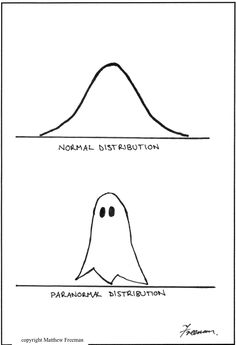

Reproducible Research Using R
========================================================
author: Jenna Krall
date: October 31, 2014
***



About me
========================================================
<br>
- PhD in Biostatistics from Johns Hopkins
- Hopkins Biostat student computing club
  - Emphasis on new tools for using R
- ``Implementing Reproducible Research'' (Stodden, Leisch, and Peng)


Why am I interested in reproducible research?
========================================================
<br>


Why am I interested in reproducible research?
========================================================
<br>


What is reproducible research?
========================================================
``...the calculation of quantitative scientific results by independent scientists using the original datasets and methods''

Which means:
- Replicability vs. Reproducibility
- ``reproducibility = tools + workflow''(Stodden, Leisch, and Peng)
- Literate statistical programming (Rossini via Knuth)
  - Programming language + documentation language
- **Linking data, code, results, and interpretation**
- Open science?


Example 1: how did we make this plot?
========================================================
 


Example 2: how did we compute those statistics?
========================================================
What dataset are they from?  If I don't know R, how can I make this table?

```
     speed           dist    
 Min.   : 4.0   Min.   :  2  
 1st Qu.:12.0   1st Qu.: 26  
 Median :15.0   Median : 36  
 Mean   :15.4   Mean   : 43  
 3rd Qu.:19.0   3rd Qu.: 56  
 Max.   :25.0   Max.   :120  
```


Example 3: Writing interpretations.
========================================================

The R dataset *cars* has 2 variables which have the labels speed and dist.  The dataset has 50 observations.  The average speed reported was 15.4 miles per hour with a standard deviation (sd) of 5.2876.  The average stopping distance was 42.98 (sd = 25.7694) feet.  


Introduction to knitr
=======================================================
<br>
<span style="color:blue">knitr</span>
- was developed by Yihui Xie at Iowa State (now at RStudio)
- has great integration with RStudio
- can be easily incorporated into your existing workflow
- is flexible and can be used with other programming languages (e.g. python) and documentation languages (e.g. html, LaTeX)
<br>

<span style="color:blue">We will focus on using knitr to integrate R and markdown</span>


knitr using R + markdown
=======================================================
<br>
- knitr = parser + evaluator + renderer
- Text (in markdown) separated by code chunks (written in R)
- Can also incorporate in-line R
- Flexible output (pdf, html, word)


